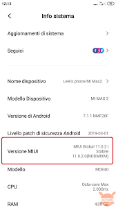
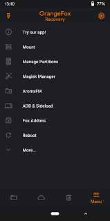
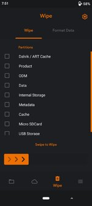

*Attenzione: bisogna avere la SIM inserita.*
*post Attenzione: Non mi prendo nessuna responsabilità sull'integrità del dispositivo finita la configurazione.*

Il primo passo è quello di loggare dal pc nell'account Xiaomi e per farlo è necessario, dal cellulare, abilitare le opzioni da sviluppatore, con questo percorso: Impostazioni -> info sistema -> premere 10 volte Versione MIUI. Apparirà una finestra che scriverà che si hanno ottenuto i permessi da sviluppatore.

Successivamente cercare "Impostazioni aggiuntive" -> Opzioni Sviluppatore  ed abilitare "Stato MiUnlock".

Ora è possibile fare l'accesso dal pc. Per farlo scarichiamo **MiUnlock** e i driver della versione del cellulare.
Controllare che i dispositivi siano abilitati alla trasmissione di dati dalle impostazioni e poi collegare i 2 dispositivi con un cavo USB che supporti la trasmissione.

Dal pc apriamo il terminale e verifichiamo che il cellulare sia collegato, con il comando:
	adb devices
Poi entriamo nella cartella download e facciamo partire Hypersploit:
	cd download
	Hypersploit
neghiamo ciò che chiede il dispositivo con "n". Con questo daremo i permessi al cellulare di poter cancellare il vecchio sistema operativo per fare spazio al nuovo.
Neghiamo nuovamente con "n" e ora bisogna attendere circa 170 ore perchè il cellulare ottenga i permessi. Finchè aspettiamo entrambi i dispositivi possono essere spenti.

SCARICARE "Orange Fox", "Project Matrixx", "zygisk",Magisk.apk" e modificarlo in .zip.

Alla fine delle 170 ore ricolleghiamo il cellulare al pc e procediamo con le indicazioni.
Sostituiamo il Boot Loader con OrangeFox tenendo premuto il tasto di spegnimento e il volume in basso finchè il cellulare si riavvia e comparirà un lucchetto sbloccato nella parte alta dello schermo.

Dovrebbe apparire questa schermata.

In automatico verrà tolto l'FRP, una chiave per verificare che il dispositivo funzioni correttamente.

Ci spostiamo sul terminale del pc e scriviamo:
	adb fastboot
e poi riavviamo il pc.
Su cmd:
	adb devices (controlliamo di essere ancora connessi)
	adb reboot bootloader
	fastboot devices
copiamo il percorso fino al fastboot
	fastboot boot recovery.img
Sul cellulare cerchiamo Flash current OrangeFox, accendiamo MTP, Data, Metadata e Internet Share

Ora riavviamo il cellulare e sul pc scriviamo:
	adb sideload Matrixx (poi premere le frecce e trova da solo il percorso)
ripetiamo lo stesso comando per zydisk e Magisk, così il nostro cellulare è pronto per ospitare il nostro nuovo sistema operativo (per me Linux).